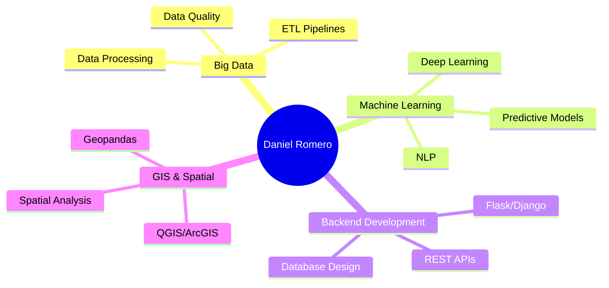

<div align="center">
  
# Hi there, I'm Daniel Romero 👋

### Software Engineer | Big Data & AI Specialist | Backend Developer

[](https://linkedin.com/in/daniromerosoftware)
[](mailto:danielromero.software@gmail.com)
[](https://github.com/Daniromero1410)


</div>

---

## 👨‍💻 About Me

```python
class DanielRomero:
    def __init__(self):
        self.role = "Software Engineer"
        self.company = "GESTAR INNOVACIÓN (POSITIVA Compañía de Seguros)"
        self.specialization = ["Big Data", "AI/ML", "Backend Development"]
        self.location = "Bucaramanga, Colombia 🇨🇴"
        self.education = {
            "degree": "Software Engineering",
            "university": "Universidad de Santander (UDES)",
            "exchange": "Technical University of Riga (Data Analytics with ML)"
        }
        self.languages = ["Spanish (Native)", "English (B2)"]
        self.interests = ["Mountaineering 🏔️", "Data Science", "Travel", "Psychology"]
    
    def current_focus(self):
        return [
            "Building scalable data pipelines",
            "Machine Learning model deployment",
            "Healthcare data analytics",
            "GIS and spatial analysis"
        ]
    
    def say_hi(self):
        print("Let's build something amazing together! 🚀")

me = DanielRomero()
me.say_hi()
```

---

## 🛠️ Tech Stack

### Languages


### Machine Learning & Data Science


### Backend & Frameworks


### Data & Databases


### DevOps & Tools


### GIS & Geospatial


---

## 💼 Professional Experience

**Software Engineer - Big Data & AI Specialist**  
📍 GESTAR INNOVACIÓN (POSITIVA Compañía de Seguros) | Bucaramanga, Colombia  
🗓️ Current

- Developing healthcare data ETL pipelines processing 100K+ records
- Building ML models for healthcare provider network analytics
- Implementing automated data validation and quality control systems
- Creating GIS tools for spatial analysis of medical services

---

## 🚀 Featured Projects

<table>
<tr>
<td width="50%">

### 🏎️ [F1 Race Winner Predictor](https://github.com/Daniromero1410/f1-race-predictor)
Deep Learning system for Formula 1 race predictions
- **Tech:** TensorFlow, Flask, scikit-learn
- **Features:** Real-time API integration, 11 predictive features
- **Deployment:** Docker, Render

</td>
<td width="50%">

### 🌋 [SIASIC-Santander](https://github.com/Daniromero1410/siasic-santander)
Seismic analysis system for Bucaramanga Seismic Nest
- **Tech:** Python, Geopandas, Folium
- **Features:** GIS export (Shapefile, GeoJSON, KML)
- **Focus:** Regional geophysical research

</td>
</tr>
<tr>
<td width="50%">

### 💼 [Job Search Automation](https://github.com/Daniromero1410/job-search-automation)
Intelligent job search with CV analysis
- **Tech:** PyPDF2, BeautifulSoup, Flask
- **Features:** PDF parsing, web scraping, smart ranking
- **Target:** Colombian job portals

</td>
<td width="50%">

### 🏥 [T25 Healthcare Consolidator](https://github.com/Daniromero1410/consolidador-t25)
ETL system for healthcare tariff data
- **Tech:** Python, pandas, openpyxl
- **Features:** SFTP integration, data validation
- **Scale:** Processing 100K+ records

</td>
</tr>
</table>

---

## 🎓 Education

**Software Engineering**  
Universidad de Santander (UDES) | Bucaramanga, Colombia  
Final semester - Expected graduation: 2025

**Academic Exchange - Data Analytics with Machine Learning**  
Technical University of Riga (RTU) | Riga, Latvia  
Master's level coursework | 2024-2025

**Research Projects**
- Seismological analysis (SIASIC-Santander)
- Migration patterns analysis with ML (Spain)
- Construction materials research (PET in concrete)

---

## 📊 GitHub Stats

<div align="center">


</div>

---

## 🏆 Expertise Areas



---

## 💡 What I Do

- 🔍 **Data Engineering:** Building robust ETL pipelines for healthcare analytics
- 🤖 **Machine Learning:** Developing predictive models for business insights
- 🗺️ **GIS Analysis:** Creating spatial analysis tools for geoscience research
- 🌐 **Web Development:** Backend systems with Flask and Django
- 📊 **Data Visualization:** Interactive dashboards and maps

---

## 🌱 Currently Learning

- Advanced Deep Learning architectures
- Cloud platforms (AWS, GCP)
- Microservices architecture
- Real-time data streaming

---

## 📫 Let's Connect!

I'm always open to interesting conversations and collaboration opportunities!

- 📧 Email: [danielromero.software@gmail.com](mailto:danielromero.software@gmail.com)
- 💼 LinkedIn: [daniromerosoftware](https://linkedin.com/in/daniromerosoftware)
- 🐙 GitHub: [@Daniromero1410](https://github.com/Daniromero1410)

---

<div align="center">

### "Ideas are the engine of progress; let's create ideas together!" 💡


</div>

